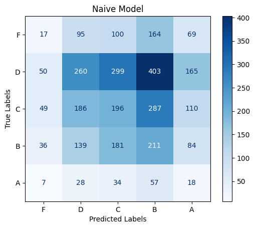
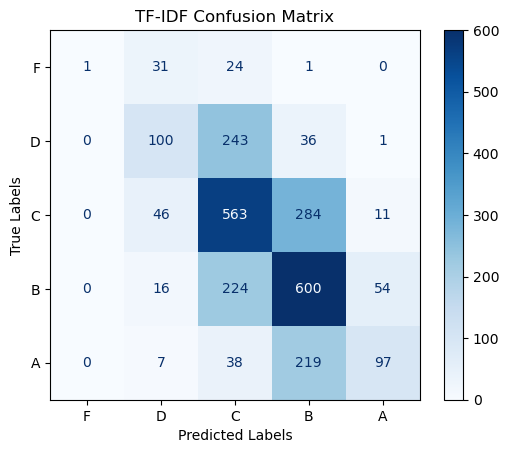
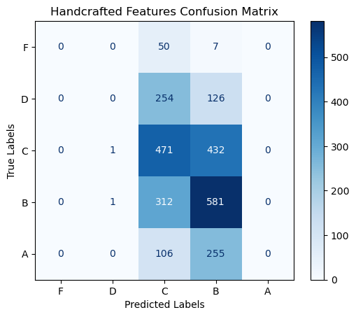
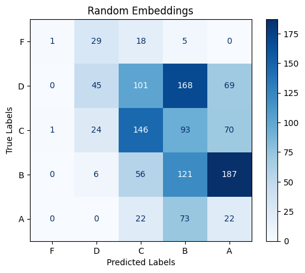
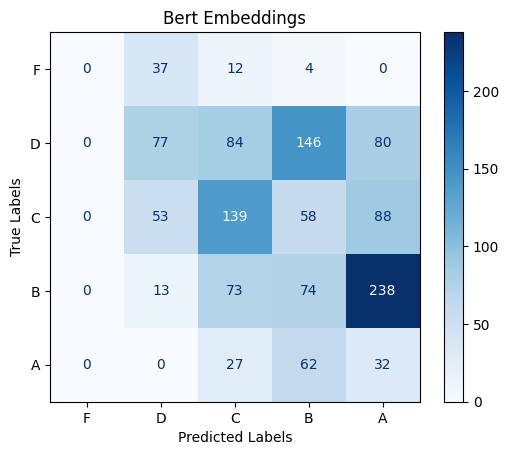
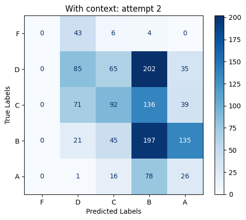
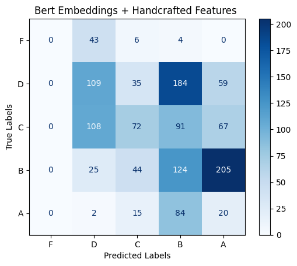

# Data and Task:  
Dataset: [The Hewlett Foundation: Automated Essay Scoring](https://www.kaggle.com/c/asap-aes)

The dataset we used for automated essay scoring comprises of essays written by students in grades 7 - 10, accompanied by scores assigned by human graders. These essays cover a range of topics and are graded on different scales depending on the topic (set). For this dataset, there are eight different topics. Within these eight topics are the following scales: 

| Essay Set | Min Score | Max Score|
|-----------|-----------|-----------|
| 1 | 1.0 |6.0|
| 2  | 1.0 |6.0|
| 3  | 0.0 |3.0|
|  4 | 0.0 |3.0|
|  5 | 0.0 |4.0|
| 6 | 0.0 |4.0|
|  7 | 2.0 |24.0|
| 8 | 10.0 |60.0|

Due to this variability, preprocessing was done to score all the essays within the eight sets on the same scale. This preprocessing utilized the maximum values, minimum values, 25th percentile, 75th percentile, and average value within the original scaling to calculate the new scale in which they are graded on uniformly throughout the dataset. One column of scoring is used for score prediction for practicality, simplicity, and consistency. A single score column simplifies the task of the machine learning model by providing a holistic assessment of the essay's quality, rather than dissecting it into multiple scoring columns. 

Preprocessing steps were taken to ensure data quality, protect privacy, and facilitate analysis. To protect the privacy of students, personally identifiable information such as names, schools, or other identifying details are removed or anonymized from the dataset. Grade levels are scaled and normalized as explained above. Cleaning of the essay data is conducted to ensure the essay is suitable for machine learning analysis. 

The primary task associated with automated essay scoring (AES) is to develop models that can predict essay scores based on various linguistic features and patterns. With this task comes inherent limitations. First, human graders may exhibit variability in their scoring due to differences in experience, subjectivity, and personal biases. This variability can introduce noise into the dataset and pose challenges for training accurate machine learning models. Second, human grades may inadvertently introduce biases into the scoring process due to factors such as demographics of the grader. This can affect the fairness and reliability of the automated scoring system. Third, automated systems offer the potential for faster grading, developing accurate models, and processing large volumes of essays, but to do this still requires substantial computational resources and time investment. 

# Evaluation Method
Quadratic Weighted Kappa (QWK), or Cohen's Kappa, is a measure that quantifies the agreement between two raters. In our project the two raters are the ground truth of the test set, and the predictions made by the model. The data is categorical, but ordinal. The quadratic part of the name refers how the scores are computed, which penalizes disagreements according to the squared distance between categories. The score ranges from -1 to 1, where 1 is perfect agreement, 0 indicated agreement is no better than random and -1 is perfect disagreement. According to [The Measurement of Observer Agreement for Categorical Data (Landis & Koch, 1977)](https://www.jstor.org/stable/2529310?origin=crossref), an arbitrary but useful way to interpret the score is as follows:(5)

| Kappa Statistic | Strength of Agreement |
|-----------------|-----------------------|
| <0.00           | Poor                  |
| 0.00-0.20       | Slight                |
| 0.21-0.40       | Fair                  |
| 0.41-0.60       | Moderate              |
| 0.61-0.80       | Substantial           |
| 0.81-1.00       | Almost Perfect        |

# Preprocessing:

## Score Scaling
The data contains 8 different sets of essays. For each of these sets, the target variable (domain1_score) is on different scales. In order to make this data work for our classification model, we need these grades on a similar scale. For simplicity and interpretability, we chose to normalize these grades to be A, B, C, D, or F. To determine what grades are equivalent to their respective letter grades, summary statistics were utilized. For a more in depth explanation, refer to the [scoring development file](preprocess/eda_and_score_scale.ipynb).

## Distribution of Scores Pre vs Post Scaling
The following table shows the distribution of letter grades after score scaling: 

| Grade | Percentage |
|-------|------------|
| A     | 0.14       |
| B     | 0.36       |
| C     | 0.34       |
| D     | 0.14       |
| F     | 0.02       |

We notice that there are mostly Bs and Cs and not very many Fs. This is consistent with what was observed during score scaling (i.e. most essay sets were skewed left - they had more Bs and Cs than Ds and Fs). 

Although the distributions pre and post scaling are fairly consistent, optimizing scaling could be an area of continued investigation.

## Handcrafted Features 

The following lexical features were extracted to use in our models. These features aim to capture various aspects of the essays' linguistic characteristics and structure.

This was a computationally expensive task which should be taken into consideration while evaluating results. 

| Feature Name                         | Description                                                               |
|--------------------------------------|---------------------------------------------------------------------------|
| **Number of Correct Words**          | Counts the number of correctly spelled words in each essay.               |
| **Number of Nouns**                  | Counts the number of nouns in each essay.                                 |
| **Number of Adjectives**             | Counts the number of adjectives in each essay.                            |
| **Average Number of Characters per Word** | Calculates the average number of characters per word in each essay.      |
| **Average Number of Characters per Sentence** | Calculates the average number of characters per sentence in each essay. |
| **Average Number of Punctuation Marks per Word** | Calculates the average number of punctuation marks per word in each essay. |
| **Average Number of Punctuation Marks per Sentence** | Calculates the average number of punctuation marks per sentence in each essay. |
| **Average Number of Words per Sentence** | Calculates the average number of words per sentence in each essay.       |
| **Average Number of Unique Words per Essay** | Calculates the average number of unique words per essay.   

# Modeling
We decided to experiment with various models to determine if we could outperform traditional methods commonly seen in other papers. This approach allowed us to systematically compare the performance of simpler models with more advanced techniques. By starting with a Naive Model and progressively incorporating more complex methods, such as Support Vector Machines with handcrafted features and Deep Learning models, we aimed to understand the strengths and weaknesses of each approach. This approach helped us identify which techniques had the most promise for accurately predicting essay grade. 

### Summary of Results
| MODEL | QWK    |
|-------|----------|
| Naive    | 0    |
| TF-IDF -> SVM     | **0.563**     |
| Handcrafted-Features -> SVM    | 0.219     |
| llama2 random embeddings     | 0.26     |
| llama2 bert embeddings     |    0.28 |
| llama2 + handcrafted features    |  0.324   |
| llama2 + bert embeddings + handcrafted features    |  0.310   |

## Naive Model
To evaluate the performance of our naive model, we employed split the dataset into training and testing sets. We then calculated the class distribution of the training set and used those weights to randomly assign class labels to the test set. This results in a QWK very close to 0, in line with expectations. 

Classification report: 

              precision    recall  f1-score   support

           0       0.11      0.04      0.06       445
           1       0.37      0.22      0.28      1177
           2       0.24      0.24      0.24       828
           3       0.19      0.32      0.24       651
           4       0.04      0.12      0.06       144

    accuracy                           0.22      3245
    macro avg       0.19      0.19     0.17      3245
    weighted avg    0.25      0.22     0.22      3245

    QWK: 0 
## TF-IDF 
TF-IDF stands for Term Frequency Inverse Document Frequency. It can be defined as the calculation of how relevant a word in a series or corpus is to a text. 
Term frequency is defined as the number of instances of a given word t. The weight of a term that occurs in a document is simply proportional to the term frequency. 
Documnet frequency tests the meaning of the text in the whole corpus collection. 
Inverse document frequency tests how relevant the word is. 

In python, the TF-IDF values can be computed using TfidfVectorizer() method in sklearn. This is the method that is used on the essay text within the dataset to predict scores. The function vectorization() within the code is designed to vectorize text data using TF-IDF vectorization. The function fits a TD_IDF Vectorizer on the X_train data, then transforms X_train, X_val, and X_test. 

Support Vector Classifier with a linear kernel is trained on the vectorized training data. Predictions are made using this model. 

Using this method the results are as follows: 

Confusion Matrix: 

Classification Report:

           precision    recall  f1-score   support

           f       1.00      0.02      0.03        57
           d       0.50      0.26      0.34       380
           c       0.52      0.62      0.56       904
           b       0.53      0.67      0.59       894
           a       0.60      0.27      0.37       361

    accuracy                           0.52      2596
    macro avg       0.63      0.37     0.38      2596
    weighted avg    0.54      0.52     0.50      2596

    QWK: 0.563
              
## Handcrafted features -> SVC
Using the handcrafted features stated above, we trained a SVC model on the features to predict essay scores. This allowed for further understanding of how the handcrafted features played a role in essay score prediction. 

Classification Report: 

              precision    recall  f1-score   support

           f       0.00      0.00      0.00        57
           d       0.00      0.00      0.00       380
           c       0.39      0.52      0.45       904
           b       0.41      0.65      0.51       894
           a       0.00      0.00      0.00       361

    accuracy                           0.41      2596
    macro avg      0.16      0.23      0.19      2596
    weighted avg   0.28      0.41      0.33      2596

    qwk: 0.219

## Deep learning methods
The models in this section were run on a RTX 3070 with 8gb of VRAM. Each model was trained for a maximum of 10 epochs.
### llama2 scaled down
The first deep learning approach we tested was a modified Llama 2 model, adapted from[ this torch titan implementation](https://github.com/pytorch/torchtitan/blob/main/torchtitan/models/llama/model.py).  Computational limitations were the guiding factor in determining scale. The main reduction was reducing the hidden dimension from 4096 to 768, bringing the total parameter count from 7 billion to 300 million. An average pooling layer and a linear layer were added to the end of the base model to adapt it for the sequence classification task. 

We chose to use a Byte-Pair Encoding algorithm, implemented with the Tokenizers library, to train our tokenizer. Based on the relative simplicity and homogeneity of the corpus text we used the default vocabulary size of 30000, although adjustments of this hyperparameter were not explored.

This model used randomly initialized token embeddings.

To recreate the training results the only requirement is to run the [train file](lm/llama2/train.ipynb) in lm/llama2, with the required packages installed. 

Classification report: 

              precision    recall  f1-score   support

           f       0.50      0.02      0.04        53
           d       0.43      0.12      0.18       383
           c       0.43      0.44      0.43       334
           b       0.26      0.33      0.29       370
           a       0.06      0.19      0.09       117

    accuracy                           0.27      1257
    macro avg       0.34      0.22     0.21      1257
    weighted avg    0.35      0.27     0.27      1257

    QWK: 0.26

### llama2 with bert embeddings

Next we trained a model with frozen pretrained embeddings, created with a bert tokenizer and model. These embeddings were then passed to the same model, bypassing the embedding layer. The results for this were mixed, the quadratic weighted kappa was 0.28 but a lower test accuracy was 0.25.

The requirements to recreate the results are the same. Run this [train file](lm/llama2_with_pretrained_embeddings/train.ipynb) in lm/llama2_with_pretrained_embeddings.

              precision    recall  f1-score   support

           f       0.00      0.00      0.00        53
           d       0.43      0.20      0.27       387
           c       0.41      0.41      0.41       338
           b       0.22      0.19      0.20       398
           a       0.07      0.26      0.11       121

    accuracy                            0.25      1297
    macro avg       0.23      0.21      0.20      1297
    weighted avg    0.31      0.25      0.26      1297

    QWK: 0.28
### llama2 with manual features

The manual features were normalized, mapped to the hidden dimension with a linear layer, then are added to the pre-attention word embeddings. We see slight improvement with the addition of these features. 

To recreate the results run this [train file](lm/llama2_with_manual_features/train.ipynb) in lm/llama2_with_manual_features.

              precision    recall  f1-score   support

           f       0.00      0.00      0.00        53
           d       0.38      0.22      0.28       387
           c       0.41      0.27      0.33       338
           b       0.32      0.49      0.39       398
           a       0.11      0.21      0.15       121

    accuracy                           0.31      1297
    macro avg       0.25      0.24     0.23      1297
    weighted avg    0.33      0.31     0.30      1297

    QWK : 0.324

### llama2, manual features + bert embeddings

To recreate the results run this [train file](lm/lama2_pe_mf/train.ipynb) in lm/llama2_with_manual_features.

              precision    recall  f1-score   support

           f       0.00      0.00      0.00        53
           d       0.38      0.28      0.32       387
           c       0.42      0.21      0.28       338
           b       0.25      0.31      0.28       398
           a       0.06      0.17      0.08       121

    accuracy                           0.25      1297
    macro avg      0.22      0.19      0.19      1297
    weighted avg   0.31      0.25      0.26      1297

    qwk: 0.310

### Results

Somewhat surprisingly, the simplest to implement model preformed the best. The TF-IDF vectorized model achieving QWK score of 0.563 was the only model that was able to break into the 'Moderate' strength of agreement category, the rest falling into the 'Fair' category. We can see some slight improvement in the deep methods as complexity increases, but this trend is broken with the very last model that uses bert embeddings and handcrafted features, although rigorous tuning was not done between deep learning models.

All four of the deep models we trained showed some similar patterns in the distribution of the scores and seemed to have similar challenges.
- Differentiating between A's and B's was very difficult. A predicted "A" when the true label was a "B" was one of the most common mistakes.
- There was a reluctance to predict "F"
- No model was able to confidently differentiate between D's,C's and B,s. 

## Challenges, Limitations and Recommendations
The need to scale our scores to a common grading system (A, B, C, D, F) introduces a limitation to our NLP classification model. This process can introduce bias, as the scaling isn't perfect and may not accurately reflect the original score distributions. Additionally, the process of scaling reduces the granularity (level of detail) of the original scores as it gets rid of potentially important nuances that can influence model predictions. 

Another limitation of this NLP classification model is that there could be biases in original grading that could be carried over and amplified through the score scaling process. For example, graders appear to not like to assign grades that are on the verge of a more round number, and would instead round up. This makes it inherently difficult for a human reviewer to consistently distinguish between closely related grades (like Ds and Cs or Cs and Bs) which emphasizes that the training data might contain inconsistencies. 

## Conclusion

Although we were not able to achieve great results with the deep learning methods, we can still draw some valuable conclusions. 

One of the most surprising findings was the strength of the TF-IDF model. This representation of the essays was robust enough to convey that the classifier was able to out preform all deep models. The deep learning model however were not able to achieve similar results. Adding in pretrained embeddings and handcrafted features did improve qwk sightly but not enough to match the TF-IDF model. 

We explored different ways to manipulate the hand crafted features to try and find the best performing variation. First we included just the raw values (number of nouns, adjective, etc.), then we normalized them by column. That gave a more relative representation of each feature, which ended up performing better during testing. 

There are many ways to try and optimize the models we have presented.
    
    - rigorous hyperparameter fine tuning
    - trainable pretrained embeddings
    - different ways to represent the hand crafted features: one-hots instead of raw values
    

One possibility of future work in this topic is a more robust and fine-tuned scoring system. This has been explored in some research, and could improve results in our work. Instead of only providing a single score, each essay is scored in many different categories, which are weighted and combined to calculate a final score. Datasets like this do exist, a recent example is a [2022 Kaggle competition](https://www.kaggle.com/competitions/feedback-prize-english-language-learning) where the goal is to evaluate essays written by english language learners. The scoring sub-categories include cohesion, syntax, vocabulary, phraseology, grammar, and conventions. 

Another direction of continued work is training a model to provide feedback for each essay with strengths, weaknesses, suggestions of improvements or justification of grades. From a preliminary search, it does not seem like there is a widely used dataset of this nature. However there have been some [recent publications](https://arxiv.org/pdf/2310.05191) that use predicted scores from an AES model and pretrained LLMs (gpt-3.5-turbo) with specific prompting to provide this type feedback. Sufficient synthetic feedback data could be used to create a purpose built feedback generation model. 

## References

(1) França, P. M., Marques, H. R., Qian, C., Monebhurrun, V., Debbah, M., & Gross, J. (2023). Reconfigurable intelligent surfaces: Bridging the gap between scattering and reflection. arXiv. https://arxiv.org/pdf/2310.05191

(2) Glymour, C. (1980). Theory and Evidence. The Journal of Philosophy, 77(11), 646-664. Retrieved May 22, 2024, from https://www.jstor.org/stable/2529310?origin=crossref

(3) Kaggle. (2023). Feedback Prize - English Language Learning. Retrieved May 22, 2024, from https://www.kaggle.com/competitions/feedback-prize-english-language-learning

(4) Kaggle. (n.d.). Automated Student Assessment Prize - Automated Essay Scoring. Retrieved May 22, 2024, from https://www.kaggle.com/c/asap-aes

(5) Landis, J. R., & Koch, G. G. (1977). The measurement of observer agreement for categorical data. Biometrics, 33(1), 159–174.

(6) PyTorch. (2023). Model.py. In torchtitan/models/llama. GitHub. Retrieved May 22, 2024, from https://github.com/pytorch/torchtitan/blob/main/torchtitan/models/llama/model.py